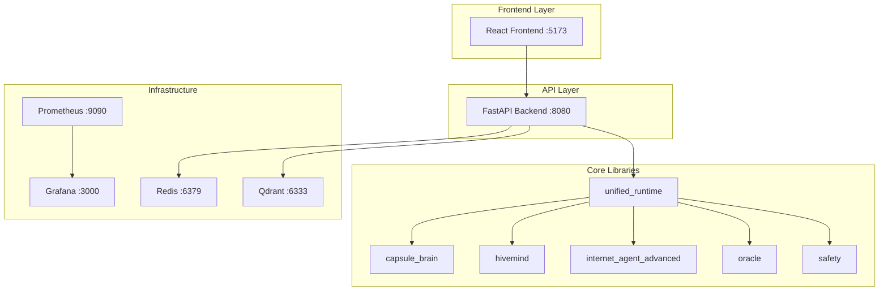

# 🧠 LIQUID-HIVE

[](https://github.com/liquid-hive/liquid-hive/actions)
[](LICENSE)
[](https://python.org)
[](https://nodejs.org)
[](SECURITY.md)
[](https://codecov.io/gh/liquid-hive/liquid-hive)

> **Production-Ready AI Cognitive System** - A unified multi-agent reasoning platform with advanced memory, retrieval, and self-improvement capabilities.

## ⚡ Quick Start

### **One-Command Development Setup**

```bash
git clone https://github.com/liquid-hive/liquid-hive.git
cd liquid-hive
make dev-setup && make dev
```

🌐 **Services Available:**
- **API**: http://localhost:8080
- **Frontend**: http://localhost:5173  
- **Grafana**: http://localhost:3000
- **Prometheus**: http://localhost:9090

### **One-Command Production Deployment**

```bash
# Docker Compose
docker compose up --build -d

# Kubernetes (Helm)
make helm-apply
```

### **API Usage**

```bash
# Health check
curl http://localhost:8080/health

# Version info
curl http://localhost:8080/version

# API endpoints
curl -X POST http://localhost:8080/api/chat \
  -H "Content-Type: application/json" \
  -d '{"query": "Analyze this data set"}'
```

## 🏗️ Architecture

**Production-Grade Microservices Architecture:**



### **Core Components**

| Component | Purpose | Location |
|-----------|---------|----------|
| 🧠 **unified_runtime** | Multi-provider LLM orchestration | `src/unified_runtime/` |
| 💾 **capsule_brain** | Long-term memory & knowledge graphs | `src/capsule_brain/` |
| 🤖 **hivemind** | Multi-agent reasoning & swarm protocols | `src/hivemind/` |
| 🌐 **internet_agent** | Web scraping & research capabilities | `src/internet_agent_advanced/` |
| 🔮 **oracle** | LLM provider abstractions (OpenAI, Claude, etc.) | `src/oracle/` |
| 🛡️ **safety** | Input/output filtering & security guards | `src/safety/` |

### **Services & Ports**

| Service | Purpose | Port | Health Check |
|---------|---------|------|--------------|
| FastAPI API | Core backend services | 8080 | `/health` |
| React Frontend | User interface | 5173 | `/` |
| Prometheus | Metrics collection | 9090 | `/metrics` |
| Grafana | Monitoring dashboards | 3000 | `/api/health` |
| Redis | Caching layer | 6379 | `ping` |
| Qdrant | Vector database | 6333 | `/health` |

## 🛠️ Developer Commands

```bash
# Development
make dev-setup     # Install dependencies & setup
make dev          # Start development stack
make test         # Run test suite with coverage
make lint         # Code quality checks
make format       # Format all code
make security     # Security vulnerability scan

# Docker Operations  
make build        # Build Docker images
make up          # Start services (background)
make down        # Stop services & cleanup
make logs        # View service logs

# Deployment
make deploy      # Deploy to Kubernetes (dev)
make helm-prod   # Deploy to production

# Utilities
make clean       # Clean temporary files
make health      # Check service health
make status      # Show system status
```

## 📦 Installation

### **Prerequisites**

- **Python 3.11+** with pip
- **Node.js 18+** with Yarn  
- **Docker** & Docker Compose
- **Optional**: kubectl, Helm (for K8s deployment)

### **Development Setup**

```bash
# Clone repository
git clone https://github.com/liquid-hive/liquid-hive.git
cd liquid-hive

# Install dependencies
make install-dev

# Configure environment
cp .env.example .env
# Edit .env with your API keys

# Start development
make dev
```

### **Production Deployment**

#### **Docker Compose (Recommended)**

```bash
# Start production stack
docker compose up --build -d

# View logs
docker compose logs -f

# Stop stack  
docker compose down -v
```

#### **Kubernetes (Advanced)**

```bash
# Deploy with Helm
helm upgrade --install liquid-hive \
  infra/helm/liquid-hive \
  -f infra/helm/liquid-hive/values-prod.yaml

# Check deployment
kubectl get pods -l app=liquid-hive
```

## ⚙️ Configuration

### **Environment Variables**

```bash
# Backend Configuration
API_PORT=8080
LOG_LEVEL=INFO
CORS_ORIGINS=http://localhost:5173

# Frontend Configuration  
VITE_API_BASE=http://localhost:8080

# Optional Services
REDIS_URL=redis://localhost:6379/0
QDRANT_URL=http://localhost:6333

# AI Providers (optional)
OPENAI_API_KEY=your_key_here
ANTHROPIC_API_KEY=your_key_here  
DEEPSEEK_API_KEY=your_key_here
```

Full configuration reference: [.env.example](.env.example)

## 🧪 Testing

### **Test Structure**
```
tests/
├── unit/          # Unit tests
├── integration/   # Integration tests  
└── performance/   # Load testing (k6)
```

### **Running Tests**

```bash
# Full test suite
make test

# Specific test types
pytest tests/unit/              # Unit tests
pytest tests/integration/       # Integration tests  
k6 run tests/performance/k6_smoke.js  # Performance tests

# With coverage
pytest --cov=src --cov-report=html
```

### **Performance Testing**

```bash
# Smoke test
make test-performance

# Custom load test
k6 run --vus 50 --duration 2m tests/performance/k6_smoke.js
```

## 🔒 Security

**Security-First Design:**

- ✅ **Input Sanitization**: All inputs filtered through safety guards
- ✅ **Output Filtering**: AI responses sanitized before delivery  
- ✅ **Dependency Scanning**: Automated vulnerability checks
- ✅ **Container Security**: Non-root containers, minimal attack surface
- ✅ **Secrets Management**: Environment-based configuration
- ✅ **Security Headers**: CORS, CSP, HSTS implemented

**Security Tools:**
- `bandit` - Python security linting
- `safety` - Vulnerability scanning
- `trivy` - Container security scanning
- `CodeQL` - Static analysis

Report security issues: [SECURITY.md](SECURITY.md)

## 📊 Monitoring & Observability

### **Built-in Monitoring**

- **Prometheus Metrics**: `/metrics` endpoint on all services
- **Grafana Dashboards**: Pre-configured dashboards for API, system metrics
- **Structured Logging**: JSON logs with correlation IDs
- **Health Checks**: Comprehensive service health monitoring

### **Key Metrics**

- Request latency (p50, p95, p99)
- Error rates by endpoint
- Agent reasoning performance
- Memory usage & retrieval accuracy
- Vector database query performance

## 🚀 Production Deployment

### **Docker Production Stack**

```bash
# Build production images
make build-prod

# Deploy with production config
docker compose -f docker-compose.yaml up -d
```

### **Kubernetes with Helm**

```bash
# Add custom values
cp infra/helm/liquid-hive/values.yaml values-custom.yaml

# Deploy
helm upgrade --install liquid-hive \
  infra/helm/liquid-hive \
  -f values-custom.yaml \
  --namespace liquid-hive \
  --create-namespace
```

### **CI/CD Pipeline**

Automated pipeline includes:
- ✅ **Multi-Python Testing** (3.11, 3.12)
- ✅ **Multi-Node Testing** (18, 20)
- ✅ **Security Scanning** (CodeQL, Trivy, Bandit)
- ✅ **Performance Testing** (k6 load tests)
- ✅ **Docker Build & Push** (on releases)
- ✅ **SBOM Generation** (Software Bill of Materials)

## 🤝 Contributing

We welcome contributions! See [CONTRIBUTING.md](CONTRIBUTING.md) for:

- Development workflow
- Code standards  
- Testing requirements
- Security guidelines

## 📖 Documentation

- **[Getting Started](docs/GETTING_STARTED.md)** - Detailed setup guide
- **[Architecture](docs/ARCHITECTURE.md)** - System design & components
- **[API Reference](docs/api/)** - Generated API documentation
- **[Operations](docs/OPERATIONS.md)** - Production operations guide
- **[Security](SECURITY.md)** - Security policies & reporting

## 📄 License

This project is licensed under the **MIT License** - see [LICENSE](LICENSE) for details.

## 🏆 Acknowledgments

Built with modern, production-grade technologies:
- **FastAPI** - High-performance Python API framework
- **React** - Modern frontend library
- **Prometheus + Grafana** - Industrial-grade monitoring
- **Docker** - Containerization platform
- **Kubernetes** - Container orchestration
- **Helm** - Kubernetes package management

---

**[⚡ Get Started Now](#quick-start)** | **[📚 Documentation](docs/)** | **[🤝 Contribute](CONTRIBUTING.md)** | **[🔒 Security](SECURITY.md)**