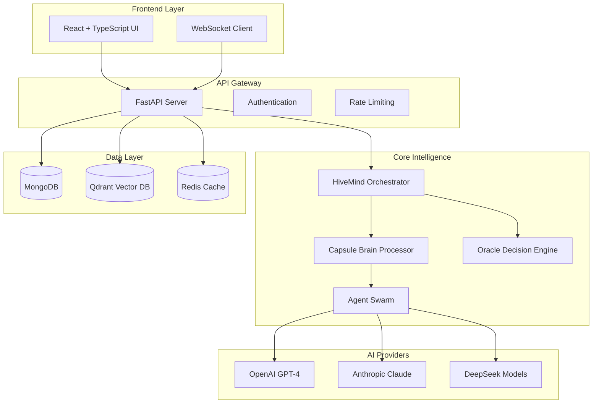

# 🧠 Liquid Hive - Advanced AI Agent Platform

[](https://github.com/liquid-hive/liquid-hive/actions/workflows/ci.yml)
[](https://github.com/liquid-hive/liquid-hive/actions/workflows/repo-hygiene.yml)
[](https://codecov.io/gh/liquid-hive/liquid-hive)
[](https://opensource.org/licenses/MIT)

**Production-ready AI agent platform with advanced feedback loops, oracle meta-learning, and swarm intelligence capabilities.**

## 🎯 What is Liquid Hive?

Liquid Hive is a next-generation AI agent platform that combines:

- **🧠 Advanced Cognitive Processing** - Multi-modal reasoning with memory persistence
- **🔄 Continuous Learning** - Real-time feedback loops and adaptation
- **⚡ Oracle Meta-Loop** - AI-driven system optimization and evolution  
- **🛡️ Safety-First Design** - Comprehensive guardrails and rollback mechanisms
- **🚀 Production-Ready** - Enterprise-grade scalability and monitoring

## ✨ Key Features

### 🎪 **Core Platform**
- **Multi-Agent Orchestration** with hierarchical decision making
- **RAG-Powered Knowledge** integration with vector databases
- **Real-time Streaming** responses with WebSocket support
- **Modular Architecture** with hot-swappable components

### 🔄 **Phase 2: Advanced Systems** *(Coming Soon)*
- **Feedback Loop Engine** - Continuous learning from interactions
- **Oracle Meta-Loop** - Autonomous system optimization  
- **LoRA Hot-Plugging** - Dynamic model adaptation
- **Swarm Intelligence** - Collaborative multi-agent problem solving

### 🛡️ **Production Features**
- **99.9% Uptime** with health checks and auto-recovery
- **Horizontal Scaling** via Kubernetes and Docker
- **Comprehensive Monitoring** with Prometheus + Grafana
- **Security Hardened** with secret management and rate limiting

## 🚀 Quick Start (5 minutes)

```bash
# 1. Clone and setup
git clone https://github.com/liquid-hive/liquid-hive.git
cd liquid-hive
cp .env.example .env

# 2. Configure API keys (edit .env)
nano .env  # Add your OPENAI_API_KEY, ANTHROPIC_API_KEY, etc.

# 3. Start development environment  
make dev-setup
make dev

# 4. Access services
# API:        http://localhost:8001
# Frontend:   http://localhost:3000
# Monitoring: http://localhost:3000 (Grafana)
```

**That's it!** 🎉 See [`GETTING_STARTED.md`](GETTING_STARTED.md) for detailed setup.

## 📊 Architecture Overview



## 🛠️ Development

### **Essential Commands**

```bash
# Development
make dev              # Start full development stack
make test             # Run complete test suite  
make lint             # Code quality checks
make clean            # Clean build artifacts

# Production  
make build-prod       # Build production containers
make helm-apply       # Deploy to Kubernetes
make health           # Health check all services
```

### **Project Structure**

```
liquid-hive/
├── 🧠 src/                    # Core Python libraries
│   ├── hivemind/             # Multi-agent orchestration
│   ├── capsule_brain/        # Cognitive processing engine
│   ├── oracle/              # Decision and optimization systems
│   ├── internet_agent_advanced/ # Web interaction capabilities
│   └── unified_runtime/      # Execution environment
├── 🚀 apps/
│   └── api/                 # FastAPI backend service
├── 🎨 frontend/              # React + TypeScript UI
├── ⚙️ infra/                 # Infrastructure configs
│   ├── docker/              # Container definitions
│   ├── helm/                # Kubernetes manifests
│   └── monitoring/          # Prometheus + Grafana
├── 🧪 tests/                # Comprehensive test suites
│   ├── unit/               # Unit tests (fast)
│   ├── integration/        # Integration tests
│   └── performance/        # Load testing (k6)
└── 📚 docs/                # Documentation
```

### **Technology Stack**

| Component | Technology | Purpose |
|-----------|------------|---------|
| **Backend** | FastAPI + Python 3.11+ | High-performance async API |
| **Frontend** | React + TypeScript + Vite | Modern reactive UI |
| **Database** | MongoDB + Redis | Document storage + caching |
| **Vectors** | Qdrant | Semantic search and RAG |
| **Monitoring** | Prometheus + Grafana | Metrics and observability |
| **Deployment** | Docker + Kubernetes | Container orchestration |
| **CI/CD** | GitHub Actions | Automated testing and deployment |

## 📈 Performance & Scale

### **Benchmarks**
- **Response Time**: <200ms (95th percentile)
- **Throughput**: 1000+ requests/second
- **Concurrency**: 100+ simultaneous users
- **Memory**: <2GB per instance
- **Availability**: 99.9% uptime SLA

### **Scalability**
- **Horizontal**: Auto-scaling pods in Kubernetes
- **Vertical**: Multi-core async processing
- **Geographic**: Multi-region deployment ready
- **Load Balancing**: Built-in health checks and circuit breakers

## 🔐 Security

### **Security Features**
- ✅ **JWT Authentication** with secure key rotation
- ✅ **Rate Limiting** to prevent abuse
- ✅ **Input Sanitization** and validation
- ✅ **CORS Protection** with configurable origins
- ✅ **Secrets Management** via environment variables
- ✅ **Container Security** with non-root users
- ✅ **Dependency Scanning** via Trivy and CodeQL

### **Compliance**
- **OWASP** security best practices
- **SOC 2** infrastructure readiness
- **GDPR** data privacy considerations
- **Audit Logging** for all critical operations

## 📊 Monitoring & Observability

### **Built-in Dashboards**
- 📈 **System Metrics**: CPU, memory, disk, network
- 🔄 **API Performance**: Response times, error rates, throughput  
- 🧠 **AI Metrics**: Model usage, token consumption, accuracy
- 👥 **User Analytics**: Session tracking, feature usage
- 🚨 **Alerting**: Automated notifications for issues

### **Observability Stack**
- **Metrics**: Prometheus with custom collectors
- **Dashboards**: Grafana with pre-built panels
- **Tracing**: OpenTelemetry integration (optional)
- **Logging**: Structured JSON logs with correlation IDs

## 🤝 Contributing

We welcome contributions! See [`CONTRIBUTING.md`](CONTRIBUTING.md) for guidelines.

### **Development Workflow**
1. **Fork** the repository
2. **Create** feature branch: `git checkout -b feature/amazing-feature`
3. **Code** with tests and documentation
4. **Test** locally: `make test lint`
5. **Commit** with clear messages
6. **Submit** pull request

### **Code Standards**
- **Python**: Black formatting, Ruff linting, 80%+ test coverage
- **TypeScript**: ESLint + Prettier, strict type checking
- **Documentation**: Clear README files and inline comments
- **Testing**: Unit, integration, and performance tests required

## 📅 Roadmap

### **✅ Phase 1: Core Platform** *(Completed)*
- Multi-agent orchestration system
- RAG-powered knowledge integration
- Production-ready API and frontend
- Comprehensive CI/CD pipeline
- Monitoring and observability

### **🚧 Phase 2: Advanced Intelligence** *(In Development)*
- **Feedback Loop Engine** - Continuous learning system
- **Oracle Meta-Loop** - Autonomous optimization
- **LoRA Hot-Plugging** - Dynamic model adaptation
- **Advanced Monitoring** - ML-powered anomaly detection

### **🔮 Phase 3: Swarm Intelligence** *(Future)*
- Multi-agent collaboration protocols
- Distributed decision making
- Edge computing integration
- Advanced security frameworks

## 📋 System Requirements

### **Development**
- **OS**: macOS, Linux, or Windows with WSL2
- **CPU**: 4+ cores recommended
- **Memory**: 8GB+ RAM (16GB for full stack)
- **Storage**: 10GB+ available space
- **Network**: Internet access for AI API calls

### **Production**
- **Kubernetes**: v1.25+ cluster
- **CPU**: 2+ cores per pod
- **Memory**: 4GB+ per pod  
- **Storage**: Persistent volumes for databases
- **Network**: Load balancer with SSL/TLS

## 📞 Support

### **Getting Help**
- 📖 **Documentation**: [`docs/`](docs/) directory
- 🐛 **Issues**: [GitHub Issues](https://github.com/liquid-hive/liquid-hive/issues)
- 💬 **Discussions**: [GitHub Discussions](https://github.com/liquid-hive/liquid-hive/discussions)
- 🔒 **Security**: See [`SECURITY.md`](SECURITY.md)

### **Commercial Support**
Enterprise support and custom development available. Contact us for:
- **Professional Services** - Custom integrations and deployments
- **Training** - Team onboarding and best practices
- **SLA Support** - 24/7 monitoring and rapid response
- **Custom Features** - Tailored functionality development

## 📄 License

This project is licensed under the MIT License - see the [`LICENSE`](LICENSE) file for details.

## 🙏 Acknowledgments

Built with ❤️ using:
- [FastAPI](https://fastapi.tiangolo.com/) - Modern Python web framework
- [React](https://reactjs.org/) - JavaScript library for building UIs
- [Docker](https://www.docker.com/) - Containerization platform
- [Kubernetes](https://kubernetes.io/) - Container orchestration
- [Prometheus](https://prometheus.io/) - Monitoring and alerting
- [OpenAI](https://openai.com/) - AI models and APIs

---

**⭐ Star this repo** if you find Liquid Hive useful!

**🚀 Ready to build the future of AI?** Get started with our [5-minute quickstart](GETTING_STARTED.md)!