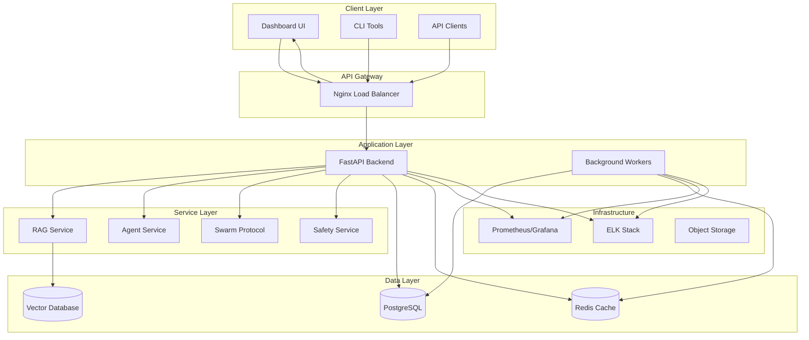
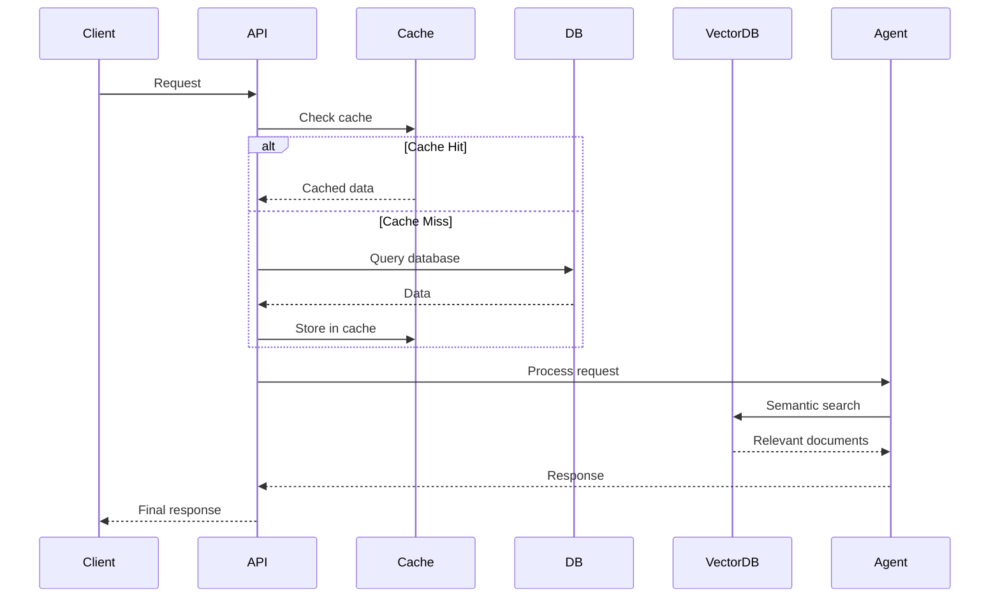

# Architecture Documentation

This document describes the system architecture, design decisions, and technical implementation of Liquid Hive.

## System Overview

Liquid Hive is a distributed AI agent platform built with microservices architecture, designed for scalability, reliability, and maintainability.

## High-Level Architecture



## Component Architecture

### API Service

The FastAPI-based API service serves as the main entry point for all client interactions.

**Key Components:**
- Authentication & Authorization
- Request Routing & Validation
- Response Serialization
- Error Handling
- Rate Limiting

**Technology Stack:**
- FastAPI (Web Framework)
- Pydantic (Data Validation)
- SQLAlchemy (ORM)
- Alembic (Migrations)
- Redis (Caching)

### Dashboard Service

React-based frontend providing the user interface for managing agents and monitoring system status.

**Key Components:**
- Agent Management Interface
- Real-time Monitoring
- Configuration Management
- User Authentication
- Data Visualization

**Technology Stack:**
- React 18 (UI Framework)
- TypeScript (Type Safety)
- Material-UI (Component Library)
- Redux Toolkit (State Management)
- Axios (HTTP Client)

### Core Libraries

#### libs/core
Core functionality shared across all services.

**Components:**
- Configuration Management
- Logging & Monitoring
- Database Models
- Utility Functions
- Version Management

#### libs/shared
Shared business logic and data structures.

**Components:**
- Agent Protocols
- Communication Standards
- Data Models
- Validation Schemas

#### libs/utils
Common utility functions and helpers.

**Components:**
- String Utilities
- Date/Time Helpers
- File Operations
- Network Utilities

## Data Architecture

### Database Design

#### PostgreSQL (Primary Database)

**Tables:**
- `agents` - Agent configurations and metadata
- `conversations` - Chat/conversation history
- `documents` - RAG document storage
- `users` - User accounts and permissions
- `sessions` - User sessions and authentication
- `audit_logs` - System audit trail

#### Redis (Caching & Session Store)

**Usage:**
- Session storage
- API response caching
- Rate limiting counters
- Real-time data (pub/sub)
- Background job queues

#### Vector Database (RAG Storage)

**Purpose:**
- Document embeddings storage
- Semantic search capabilities
- Knowledge base management

### Data Flow



## Security Architecture

### Authentication & Authorization

**Authentication Methods:**
- JWT tokens (API access)
- Session-based (Web UI)
- API keys (Service-to-service)

**Authorization Levels:**
- Admin (Full access)
- User (Limited access)
- Service (Internal access)
- Read-only (Monitoring access)

### Security Measures

1. **Input Validation**
   - Pydantic schemas
   - SQL injection prevention
   - XSS protection

2. **Network Security**
   - HTTPS/TLS encryption
   - CORS configuration
   - Rate limiting

3. **Data Protection**
   - Encryption at rest
   - Secure key management
   - Audit logging

## Deployment Architecture

### Container Strategy

**Multi-stage Docker builds:**
- Builder stage: Install dependencies, compile assets
- Runtime stage: Minimal runtime with non-root user

**Base Images:**
- Python: `python:3.11-slim`
- Node.js: `node:18-alpine`
- Nginx: `nginx:alpine`

### Orchestration

**Docker Compose (Development):**
- Single-node deployment
- Service discovery
- Volume management
- Network isolation

**Kubernetes (Production):**
- Multi-node deployment
- Auto-scaling
- Rolling updates
- Health checks

### Monitoring & Observability

**Metrics Collection:**
- Prometheus (Metrics)
- Grafana (Dashboards)
- Custom business metrics

**Logging:**
- Structured JSON logs
- Centralized log aggregation
- Log correlation IDs

**Tracing:**
- Distributed tracing
- Request flow visualization
- Performance analysis

## Scalability Design

### Horizontal Scaling

**API Scaling:**
- Stateless design
- Load balancer distribution
- Auto-scaling based on metrics

**Database Scaling:**
- Read replicas
- Connection pooling
- Query optimization

**Cache Scaling:**
- Redis Cluster
- Consistent hashing
- Failover mechanisms

### Performance Optimization

**Caching Strategy:**
- Multi-level caching
- Cache invalidation
- TTL management

**Database Optimization:**
- Indexing strategy
- Query optimization
- Connection pooling

**CDN Integration:**
- Static asset delivery
- Geographic distribution
- Cache headers

## Configuration Management

### Environment-based Configuration

**Configuration Hierarchy:**
1. Environment variables (highest priority)
2. Environment-specific YAML files
3. Base configuration YAML
4. Default values (lowest priority)

**Configuration Sources:**
- `configs/base/` - Base configuration
- `configs/dev/` - Development overrides
- `configs/prod/` - Production overrides
- `configs/test/` - Testing overrides

### Feature Flags

**Runtime Configuration:**
- Feature toggles
- A/B testing support
- Gradual rollouts
- Emergency switches

## Error Handling & Resilience

### Error Handling Strategy

**Error Types:**
- Validation errors (400)
- Authentication errors (401)
- Authorization errors (403)
- Not found errors (404)
- Server errors (500)

**Error Response Format:**
```json
{
  "error": {
    "code": "VALIDATION_ERROR",
    "message": "Invalid input data",
    "details": {...},
    "timestamp": "2024-01-01T12:00:00Z",
    "request_id": "req_123456"
  }
}
```

### Resilience Patterns

**Circuit Breaker:**
- External service calls
- Database connections
- Cache operations

**Retry Logic:**
- Exponential backoff
- Jitter for distributed systems
- Maximum retry limits

**Graceful Degradation:**
- Fallback responses
- Reduced functionality
- User notifications

## Development Workflow

### Code Organization

**Monorepo Structure:**
- Shared libraries
- Independent services
- Unified tooling
- Consistent standards

**Development Tools:**
- Pre-commit hooks
- Automated testing
- Code formatting
- Type checking

### CI/CD Pipeline

**Pipeline Stages:**
1. Code quality checks
2. Unit tests
3. Integration tests
4. Security scanning
5. Build artifacts
6. Deploy to staging
7. E2E tests
8. Deploy to production

**Quality Gates:**
- Test coverage > 80%
- No critical security issues
- All tests passing
- Code review approval

## Future Considerations

### Planned Enhancements

**Microservices Evolution:**
- Service mesh integration
- Event-driven architecture
- CQRS pattern implementation

**AI/ML Integration:**
- Model serving infrastructure
- A/B testing framework
- Performance monitoring

**Observability Improvements:**
- Distributed tracing
- Custom dashboards
- Alerting rules

### Technology Roadmap

**Short Term (3 months):**
- Kubernetes deployment
- Enhanced monitoring
- Performance optimization

**Medium Term (6 months):**
- Service mesh adoption
- Event streaming
- Advanced security features

**Long Term (12 months):**
- Multi-cloud deployment
- Edge computing support
- Advanced AI capabilities