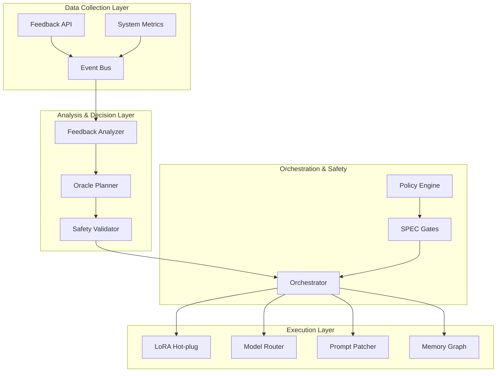

# 🧠 Liquid Hive Feedback Loop + Oracle Meta-Loop System

**Complete Documentation for the Advanced AI Feedback and Optimization System**

## 🎯 System Overview

The Feedback Loop + Oracle Meta-Loop system is an advanced AI-driven platform that automatically collects user feedback, analyzes patterns, generates optimization plans, validates changes for safety, and executes improvements with comprehensive rollback mechanisms.

### **Key Components**



## 🔄 The Complete Feedback Loop

### **Phase 1: Data Collection**

**Feedback API** (`/app/services/feedback_api/`)
- Collects explicit feedback (ratings, corrections, complaints)
- Monitors implicit feedback (success rates, response times, usage patterns)
- Aggregates system metrics and performance data
- Routes events to the event bus for processing

**Event Bus** (`/app/services/event_bus/`)
- High-performance in-memory event routing
- Publisher-subscriber pattern with filtering
- Event persistence and replay capabilities
- Dead letter queue for failed events

### **Phase 2: Pattern Analysis**

**Feedback Analyzer** (`/app/services/oracle_api/analyzer.py`)
- **Performance Degradation Detection**: Identifies agents with declining response times or success rates
- **User Dissatisfaction Analysis**: Detects low ratings and complaint patterns
- **Usage Pattern Recognition**: Finds load imbalances and underutilized resources
- **Statistical Analysis**: Confidence intervals and significance testing

### **Phase 3: Decision Making**

**Oracle Planner** (`/app/services/oracle_api/planner.py`)
- **Mutation Strategy Engine**: Generates specific optimization actions
- **Confidence Scoring**: Evaluates likelihood of improvement
- **Priority Management**: Orders actions by impact and urgency
- **Resource Planning**: Considers system capacity and constraints

**Mutation Types:**
- `PROMPT_PATCH`: Optimize prompts for better responses
- `MODEL_SWAP`: Switch between AI models for performance
- `LORA_APPLY`: Apply fine-tuned adaptations
- `ROUTE_CHANGE`: Rebalance traffic between agents
- `PARAM_SET`: Adjust system parameters
- `MEMORY_UPDATE`: Update agent context and memory

### **Phase 4: Safety Validation**

**Safety Validator** (`/app/services/oracle_api/validator.py`)
- **SPEC Gates**: Deterministic safety checks and policy compliance
- **Regression Testing**: Automated test suites to prevent quality degradation
- **Performance Validation**: Ensure changes don't harm system performance
- **Security Scanning**: Detect potential security vulnerabilities
- **Canary Deployment**: Gradual rollout with monitoring

**Safety Checks:**
- Policy compliance validation
- Resource safety analysis
- Concurrency conflict detection
- Rollback viability assessment
- Impact risk evaluation

### **Phase 5: Execution**

**Model Router** (`/app/services/adapters/model_router.py`)
- Dynamic routing between AI models (GPT-4, Claude, DeepSeek, etc.)
- Load balancing and performance optimization
- Circuit breaker pattern for failing endpoints
- Real-time performance monitoring

**LoRA Hot-plugging** (`/app/services/adapters/lora_hotplug.py`)
- Dynamic application/removal of LoRA adapters
- Safe no-op fallback when LoRA unavailable
- Performance tracking and rollback capabilities
- Memory-efficient adapter management

**Prompt Patcher** (`/app/services/adapters/prompts_patcher.py`)
- Version-controlled prompt modifications
- A/B testing for prompt effectiveness
- Rollback to previous versions
- Performance impact tracking

**Memory Graph** (`/app/services/adapters/memory_graph.py`)
- Persistent agent memory and learning
- Context-aware information retrieval
- Importance-based memory pruning
- Cross-session knowledge retention

## 🎼 Orchestration & Policies

### **Pipeline Configuration** (`/app/services/orchestrator/orchestrator.yaml`)

```yaml
pipeline:
  - name: collect     # Data ingestion
  - name: analyze     # Pattern detection
  - name: decide      # Mutation planning
  - name: validate    # Safety checks
  - name: execute     # Change implementation
  - name: monitor     # Impact assessment
```

### **Policy Engine** (`/app/services/orchestrator/policies/oracle_policies.yaml`)

**Safety Thresholds:**
- Maximum 10 mutations per hour
- Minimum confidence threshold: 0.7
- Automatic rollback on error rates >15%
- Manual approval required for high-risk changes

**Performance Targets:**
- Response time improvement: 20%
- Success rate target: 95%+
- User satisfaction target: 4.5/5
- Cost optimization: Up to 20% savings

## 🚀 Getting Started

### **1. Service Architecture**

The system runs as microservices:

```bash
# Start Feedback API
uvicorn services.feedback_api.main:app --port 8091

# Start Oracle API  
uvicorn services.oracle_api.main:app --port 8092

# Services communicate via event bus
```

### **2. Basic Usage**

**Collect Feedback:**
```python
import httpx

# Explicit user feedback
feedback = {
    "agent_id": "helpful_assistant",
    "session_id": "user_123_session",
    "explicit": {"rating": 4.5, "helpful": True},
    "implicit": {"response_time_ms": 250, "success_rate": 0.95}
}

response = httpx.post("http://localhost:8091/api/v1/feedback/collect", json=feedback)
```

**Trigger Analysis:**
```python
# Analyze recent feedback
analysis_request = {"time_window_hours": 24, "event_limit": 1000}
response = httpx.post("http://localhost:8092/api/v1/oracle/analyze", json=analysis_request)
findings = response.json()["analysis"]
```

**Generate Optimization Plan:**
```python
# Create mutation plan
plan_request = {"findings": findings}
response = httpx.post("http://localhost:8092/api/v1/oracle/plan", json=plan_request)
plan = response.json()["plan"]
```

**Validate and Execute:**
```python
# Safety validation
validate_request = {"plan": plan}
validation = httpx.post("http://localhost:8092/api/v1/oracle/validate", json=validate_request)

if validation.json()["overall_passed"]:
    # Execute changes
    execute_request = {"plan": plan, "dry_run": False}
    httpx.post("http://localhost:8092/api/v1/oracle/execute", json=execute_request)
```

### **3. Automated Processing**

**Oracle Tick (Scheduled):**
```bash
# Trigger complete feedback loop
curl -X POST http://localhost:8092/api/v1/oracle/tick
```

This runs the full cycle: analyze → plan → validate → execute

## 🛡️ Safety & Rollback

### **Multi-Layer Safety**

1. **Input Validation**: All feedback and plans validated before processing
2. **SPEC Gates**: Deterministic safety checks prevent harmful changes  
3. **Regression Testing**: Automated tests catch quality degradation
4. **Canary Deployment**: Gradual rollout with monitoring
5. **Circuit Breakers**: Automatic failure detection and isolation
6. **Emergency Rollback**: One-command restoration to previous state

### **Rollback Procedures**

**Automatic Rollback Triggers:**
- Error rate >15% 
- Response time >10 seconds
- User complaints >5 in 10 minutes
- Manual emergency trigger

**Manual Rollback:**
```python
# Emergency rollback
rollback_request = {"rollback_key": "rollback_12345", "emergency": True}
httpx.post("http://localhost:8092/api/v1/oracle/rollback", json=rollback_request)
```

## 📊 Monitoring & Observability

### **Key Metrics**

**System Health:**
- Events processed per minute
- Analysis completion time
- Plan generation success rate
- Safety validation pass rate
- Execution success rate

**Business Impact:**
- User satisfaction trends
- Response time improvements
- Success rate increases
- Cost optimization achieved
- Agent utilization balance

### **Dashboards**

The system integrates with Prometheus and Grafana for comprehensive monitoring:

- **Feedback Dashboard**: Collection rates, sentiment analysis, pattern detection
- **Oracle Dashboard**: Plan generation, safety validation, execution success
- **Performance Dashboard**: Response times, success rates, resource utilization
- **Safety Dashboard**: SPEC gate status, rollback events, security alerts

## 🔧 Configuration

### **Environment Variables** (`.env`)

```bash
# Feedback Loop System
FEEDBACK_LOOP_ENABLED=true
ORACLE_SYSTEM_ENABLED=true
LORA_HOTPLUG_ENABLED=true

# Oracle Configuration
ORACLE_CONFIDENCE_THRESHOLD=0.7
ORACLE_MAX_MUTATIONS_PER_HOUR=10
ORACLE_AUTO_ROLLBACK=true

# Safety Settings
SAFETY_CHECKS_ENABLED=true
REQUIRE_APPROVAL_FOR_HIGH_RISK=true
CANARY_DEPLOYMENT_PERCENT=5

# Event Bus
EVENT_BUS_TYPE=memory
EVENT_BUS_MAX_SIZE=10000
```

### **Policy Customization**

Edit `/app/services/orchestrator/policies/oracle_policies.yaml`:

```yaml
# Custom thresholds
thresholds:
  performance:
    response_time:
      warning_threshold_ms: 1500
      critical_threshold_ms: 3000
  satisfaction:
    rating:
      warning_threshold: 3.5
      critical_threshold: 2.5
```

## 🧪 Testing

### **Unit Tests**
```bash
# Test individual components
pytest tests/services/test_feedback_api.py -v
pytest tests/services/test_oracle_api.py -v
```

### **Integration Tests**
```bash
# Test complete feedback loop
pytest tests/integration/test_feedback_loop.py -v
```

### **Load Testing**
```bash
# Stress test the system
k6 run tests/performance/feedback_loop_load.js
```

## 📈 Performance Characteristics

### **Benchmarks**

| Component | Throughput | Latency (p95) | Memory |
|-----------|------------|---------------|---------|
| Feedback API | 1000 events/sec | <100ms | <512MB |
| Oracle Analysis | 500 events/sec | <2s | <1GB |
| Safety Validation | 50 plans/min | <30s | <256MB |
| Execution | 20 plans/min | <60s | <512MB |

### **Scalability**

- **Horizontal**: Multiple API instances behind load balancer
- **Vertical**: Efficient async processing with coroutines
- **Event Bus**: Supports clustering and persistence backends
- **Storage**: Configurable retention and archival policies

## 🔮 Advanced Features

### **Machine Learning Integration**

The system is designed for easy ML integration:

- **Pattern Detection**: Pluggable algorithms (isolation forest, LSTM)
- **Optimization Models**: Reinforcement learning for decision making
- **Prediction**: Forecasting system performance and user satisfaction
- **Anomaly Detection**: Unsupervised learning for edge case identification

### **Multi-Agent Orchestration**

- **Agent Specialization**: Different agents for different domains
- **Load Balancing**: Intelligent routing based on capabilities
- **Collaborative Learning**: Agents learn from each other's feedback
- **Hierarchical Decision Making**: Multi-level optimization strategies

## 🤝 Contributing

See [`CONTRIBUTING.md`](../CONTRIBUTING.md) for development guidelines.

### **Extension Points**

- **Custom Analyzers**: Implement new pattern detection algorithms
- **Mutation Strategies**: Add new optimization approaches  
- **Safety Validators**: Extend validation with domain-specific checks
- **Execution Adapters**: Support for additional AI platforms

## 📞 Support

- **Documentation**: Complete API docs at `/docs` endpoints
- **Issues**: GitHub issues for bug reports and feature requests
- **Monitoring**: Built-in health checks and status endpoints
- **Debugging**: Comprehensive logging with correlation IDs

---

**🎉 The Feedback Loop + Oracle Meta-Loop system represents the cutting edge of AI system optimization - combining the power of continuous learning with robust safety mechanisms for production-ready autonomous improvement.**