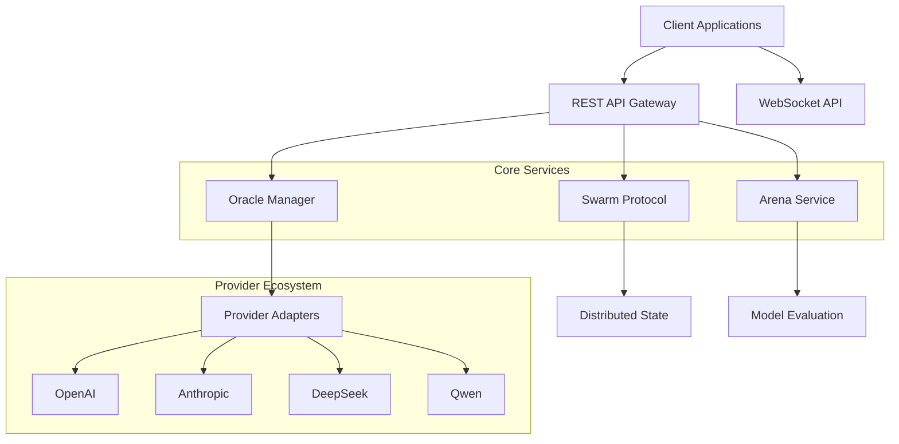

# API Overview

## Introduction

The Liquid-Hive-Upgrade system provides a comprehensive set of APIs for interacting with Oracle Providers, managing distributed swarm intelligence, and building sophisticated AI applications. This documentation covers all public APIs, functions, and components available in the system.

## Architecture Overview



## API Categories

### 1. Core Chat & Inference APIs
- **Chat API**: Real-time conversation with AI models
- **Vision API**: Image analysis and multimodal interactions
- **Streaming API**: WebSocket-based real-time communication

### 2. Oracle Provider Management
- **Provider Configuration**: Dynamic provider routing and configuration
- **Health Monitoring**: Provider availability and performance tracking
- **Cost Optimization**: Intelligent routing based on cost profiles

### 3. Swarm Intelligence
- **Task Delegation**: Distributed task processing across swarm nodes
- **Coordination**: Swarm state management and synchronization
- **Resource Estimation**: Dynamic resource allocation and optimization

### 4. Arena & Evaluation
- **Model Comparison**: Side-by-side model evaluation
- **Leaderboard**: Performance tracking and ranking
- **Task Submission**: Evaluation task management

### 5. Security & Authentication
- **API Key Management**: Secure authentication mechanisms
- **Rate Limiting**: Request throttling and abuse prevention
- **Secrets Management**: Secure credential storage and rotation

## Base URLs

| Environment | Base URL | Description |
|-------------|----------|-------------|
| Development | `http://localhost:8000` | Local development server |
| Staging | `https://staging-api.liquid-hive.dev` | Staging environment |
| Production | `https://api.liquid-hive.dev` | Production environment |

## Authentication

All API requests require authentication using an API key:

```http
x-api-key: your-api-key-here
```

## Rate Limits

| Endpoint Category | Rate Limit | Window |
|------------------|------------|---------|
| Chat APIs | 100 requests | 1 minute |
| Vision APIs | 50 requests | 1 minute |
| Arena APIs | 200 requests | 1 minute |
| Admin APIs | 20 requests | 1 minute |

## Response Format

All API responses follow a consistent JSON structure:

```json
{
  "success": true,
  "data": { ... },
  "timestamp": "2024-01-01T00:00:00Z",
  "request_id": "req_123456"
}
```

Error responses:

```json
{
  "success": false,
  "error": {
    "code": "INVALID_REQUEST",
    "message": "Request validation failed",
    "details": { ... }
  },
  "timestamp": "2024-01-01T00:00:00Z",
  "request_id": "req_123456"
}
```

## Quick Start

### 1. Install SDK

=== "Python"
    ```bash
    pip install liquid-hive-client
    ```

=== "JavaScript/Node.js"
    ```bash
    npm install @liquid-hive/client
    ```

### 2. Initialize Client

=== "Python"
    ```python
    from liquid_hive import LiquidHiveClient
    
    client = LiquidHiveClient(
        base_url="https://api.liquid-hive.dev",
        api_key="your-api-key"
    )
    ```

=== "JavaScript"
    ```javascript
    import { LiquidHiveClient } from '@liquid-hive/client';
    
    const client = new LiquidHiveClient({
      baseUrl: 'https://api.liquid-hive.dev',
      apiKey: 'your-api-key'
    });
    ```

### 3. Make Your First Request

=== "Python"
    ```python
    # Health check
    health = await client.health()
    print(f"System status: {health}")
    
    # Chat with AI
    response = await client.chat("Hello, how can you help me?")
    print(f"AI Response: {response['message']}")
    ```

=== "JavaScript"
    ```javascript
    // Health check
    const health = await client.health();
    console.log('System status:', health);
    
    // Chat with AI
    const response = await client.chat("Hello, how can you help me?");
    console.log('AI Response:', response.message);
    ```

## WebSocket API

For real-time interactions, use the WebSocket API:

```javascript
const ws = new WebSocket('wss://api.liquid-hive.dev/ws/chat');

ws.onopen = () => {
  ws.send(JSON.stringify({
    type: 'chat',
    message: 'Hello!',
    stream: true
  }));
};

ws.onmessage = (event) => {
  const data = JSON.parse(event.data);
  console.log('Streaming response:', data);
};
```

## Error Handling

Common error codes and their meanings:

| Code | Description | Action |
|------|-------------|---------|
| `INVALID_API_KEY` | API key is missing or invalid | Check authentication |
| `RATE_LIMIT_EXCEEDED` | Too many requests | Implement backoff |
| `PROVIDER_UNAVAILABLE` | Oracle provider is down | Retry with different provider |
| `INSUFFICIENT_CREDITS` | Account balance too low | Top up account |
| `VALIDATION_ERROR` | Request parameters invalid | Check request format |

## Next Steps

- [Authentication Guide](authentication.md) - Detailed authentication setup
- [Endpoints Reference](endpoints.md) - Complete API endpoint documentation
- [SDK Documentation](sdks.md) - Language-specific SDK guides
- [Integration Examples](../user-guide/integration-examples.md) - Real-world usage examples

## Support

- **Documentation**: [https://docs.liquid-hive.dev](https://docs.liquid-hive.dev)
- **GitHub Issues**: [https://github.com/liquid-hive/upgrade/issues](https://github.com/liquid-hive/upgrade/issues)
- **Community Discord**: [https://discord.gg/liquid-hive](https://discord.gg/liquid-hive)
- **Email Support**: [support@liquid-hive.dev](mailto:support@liquid-hive.dev)