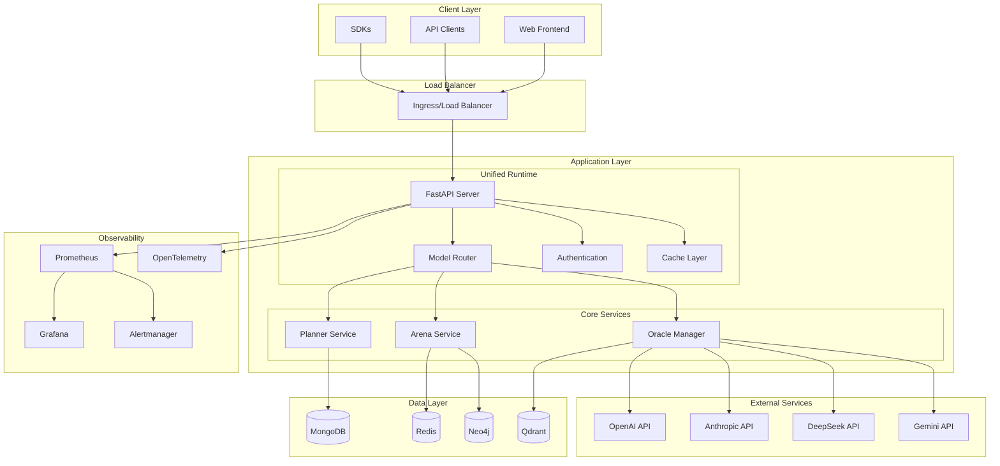
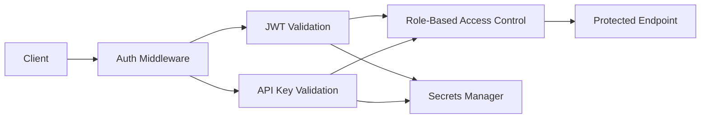
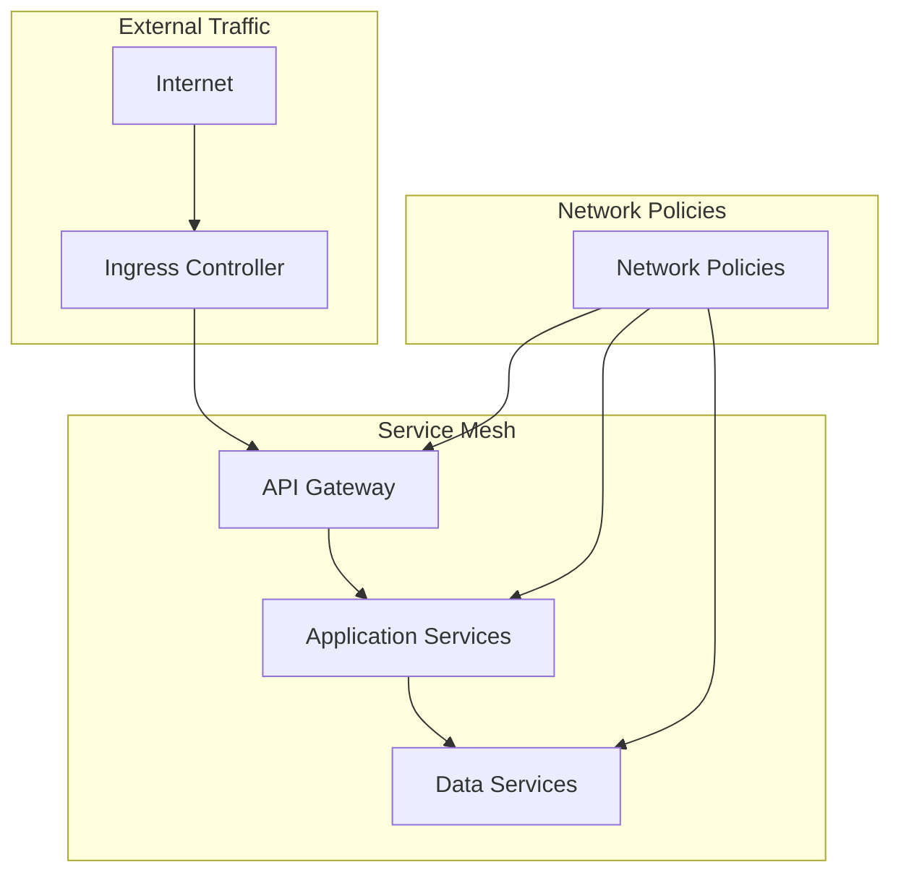
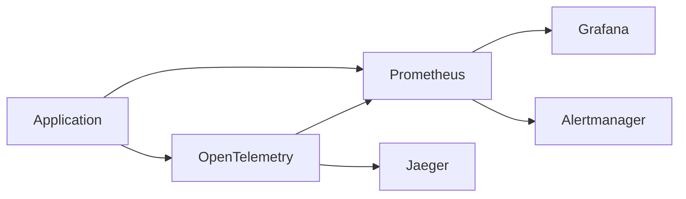

# System Architecture Overview

## Introduction

Liquid-Hive-Upgrade is a sophisticated Oracle Provider Router system designed for large-scale LLM operations with built-in planning, evaluation, and observability capabilities. The system follows microservices architecture principles with a focus on scalability, reliability, and maintainability.

## High-Level Architecture



## Core Components

### 1. Unified Runtime Server

The central FastAPI application that orchestrates all system components:

- **Responsibilities**:

  - HTTP request handling and routing
  - Authentication and authorization
  - Rate limiting and quota management
  - Health checks and status monitoring
  - Metrics collection and tracing

- **Key Features**:
  - Asynchronous request processing
  - Middleware for cross-cutting concerns
  - Dynamic service mounting based on configuration
  - Comprehensive error handling

### 2. Oracle Provider Manager

Manages multiple LLM providers with hot-swappable configurations:

- **Capabilities**:

  - Dynamic provider loading from configuration
  - API key management and rotation
  - Circuit breaker patterns for reliability
  - Cost tracking and budget management

- **Supported Providers**:
  - OpenAI (GPT models)
  - Anthropic (Claude models)
  - DeepSeek (DeepSeek models)
  - Google (Gemini models)

### 3. Model Router (DSRouter)

Intelligent routing engine for LLM requests:

- **Routing Strategies**:

  - Cost-optimized routing
  - Performance-based routing
  - Arena-driven routing (win-rate bias)
  - Fallback chain handling

- **Economic Routing Profiles**:
  - **Cheap**: Prioritizes cost-effective providers
  - **Balanced**: Balances cost and performance
  - **Quality**: Prioritizes high-performance providers

### 4. Planner Service

DAG-based task execution engine:

- **Features**:

  - Directed Acyclic Graph (DAG) task planning
  - Parallel execution capabilities
  - Retry mechanisms with exponential backoff
  - Built-in task operations (HTTP, file operations, etc.)

- **Task Types**:
  - HTTP requests
  - File operations
  - Data transformations
  - LLM invocations

### 5. Arena Service

Model evaluation and comparison platform:

- **Evaluation Methods**:

  - A/B testing between models
  - Elo rating system
  - Performance analytics
  - Win-rate tracking

- **Features**:
  - Task submission and comparison
  - Leaderboard generation
  - Historical performance tracking
  - Bias detection and mitigation

## Data Architecture

### Primary Data Stores

#### MongoDB (Primary Database)

- **Usage**: User data, sessions, task definitions
- **Schema**: Document-based with validation
- **Indexes**: Optimized for common query patterns
- **Scaling**: Replica sets for high availability

#### Redis (Cache & Sessions)

- **Usage**: Session storage, rate limiting, caching
- **Configuration**: Persistence enabled, memory optimization
- **Patterns**: Cache-aside, write-through
- **Scaling**: Redis Cluster for horizontal scaling

#### Neo4j (Graph Database)

- **Usage**: Complex relationships, knowledge graphs
- **Query Language**: Cypher
- **Plugins**: APOC, Graph Data Science
- **Scaling**: Causal clustering

#### Qdrant (Vector Database)

- **Usage**: Embeddings storage, similarity search
- **Features**: HNSW indexing, quantization
- **API**: REST and gRPC interfaces
- **Scaling**: Horizontal scaling with collections

## Security Architecture

### Authentication & Authorization



### Security Layers

1. **Transport Security**:

   - TLS 1.3 for all communications
   - Certificate management
   - HSTS headers

2. **Authentication**:

   - JWT tokens with RS256 signing
   - API key authentication
   - Multi-factor authentication (planned)

3. **Authorization**:

   - Role-based access control (RBAC)
   - Resource-level permissions
   - Rate limiting per tenant

4. **Data Protection**:
   - Encryption at rest
   - PII detection and redaction
   - Audit logging with HMAC signatures

## Network Architecture

### Service Communication



### Communication Patterns

1. **Synchronous**: REST APIs for real-time operations
2. **Asynchronous**: Message queues for background tasks
3. **Streaming**: WebSockets for real-time updates
4. **Caching**: Redis for performance optimization

## Scaling Strategy

### Horizontal Scaling

- **Application Tier**: Auto-scaling with HPA
- **Database Tier**: Read replicas and sharding
- **Cache Tier**: Redis Cluster
- **Load Balancing**: Round-robin with health checks

### Vertical Scaling

- **Resource Limits**: CPU and memory constraints
- **Performance Tuning**: JVM tuning, connection pooling
- **Monitoring**: Resource utilization metrics

## Deployment Architecture

### Container Strategy

```dockerfile
# Multi-stage builds for optimization
FROM python:3.11-slim as builder
# Build dependencies

FROM python:3.11-slim as runtime
# Runtime configuration
```

### Kubernetes Deployment

```yaml
# Deployment with rolling updates
apiVersion: apps/v1
kind: Deployment
spec:
  replicas: 3
  strategy:
    type: RollingUpdate
    rollingUpdate:
      maxUnavailable: 1
      maxSurge: 1
```

### Service Discovery

- **Kubernetes Services**: Internal service discovery
- **Ingress Controllers**: External traffic routing
- **DNS**: Service name resolution
- **Health Checks**: Liveness and readiness probes

## Observability Architecture

### Metrics Collection



### Monitoring Stack

1. **Metrics**: Prometheus for time-series data
2. **Visualization**: Grafana dashboards
3. **Alerting**: Alertmanager for notifications
4. **Tracing**: OpenTelemetry with Jaeger
5. **Logging**: Structured logging with ELK stack

### Key Metrics

- **Golden Signals**: Latency, traffic, errors, saturation
- **Business Metrics**: API usage, cost per request
- **Infrastructure**: CPU, memory, disk, network
- **Application**: Arena win rates, provider performance

## Disaster Recovery

### Backup Strategy

1. **Database Backups**: Daily automated backups
2. **Configuration Backups**: Git-based versioning
3. **Container Images**: Multi-region registry
4. **Secrets**: Encrypted backup to secure storage

### Recovery Procedures

1. **RTO Target**: 4 hours for full system recovery
2. **RPO Target**: 1 hour maximum data loss
3. **Failover**: Automated with health checks
4. **Testing**: Monthly DR drills

## Performance Characteristics

### Latency Targets

- **API Responses**: < 100ms p95
- **LLM Provider Calls**: < 2s p95
- **Database Queries**: < 50ms p95
- **Cache Hits**: < 5ms p95

### Throughput Targets

- **API Requests**: 10,000 RPS per instance
- **Concurrent Users**: 50,000+
- **Database TPS**: 5,000 transactions/second
- **Cache Operations**: 100,000 ops/second

## Future Architecture Considerations

### Planned Enhancements

1. **Multi-Region Deployment**: Global distribution
2. **Event-Driven Architecture**: Async messaging
3. **Machine Learning Pipeline**: Model training automation
4. **Advanced Security**: Zero-trust networking

### Technology Roadmap

- **Service Mesh**: Istio implementation
- **Serverless**: Function-based scaling
- **AI/ML Operations**: MLOps pipeline
- **Edge Computing**: Edge deployments

---

This architecture overview provides the foundation for understanding how Liquid-Hive-Upgrade operates at scale. For detailed implementation specifics, refer to the component-specific documentation.
