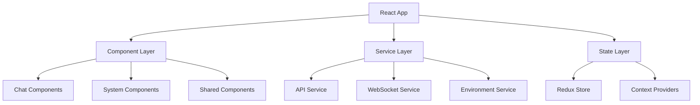

# Frontend Development Guide

This guide covers the React-based frontend application, including components, services, and development practices.

## Table of Contents

- [Architecture Overview](#architecture-overview)
- [Component Library](#component-library)
- [Services & API Integration](#services--api-integration)
- [State Management](#state-management)
- [Development Setup](#development-setup)
- [Component Documentation](#component-documentation)
- [Testing](#testing)
- [Build & Deployment](#build--deployment)

## Architecture Overview

The frontend is built with:
- **React 18** with TypeScript
- **Material-UI (MUI)** for UI components
- **Redux Toolkit** for state management
- **Vite** for build tooling
- **WebSocket** for real-time communication



## Component Library

### Core Components

#### App.tsx
The main application component with navigation and theme management.

**Features:**
- Material-UI theme with dark/light mode
- Responsive drawer navigation
- Health monitoring
- Provider status display

**Usage:**
```tsx
import App from './App';
import { Provider } from 'react-redux';
import { store } from './store';

function Root() {
  return (
    <Provider store={store}>
      <App />
    </Provider>
  );
}
```

### Chat Components

#### ChatPanel

Basic chat interface for AI interactions.

**Props:**
```tsx
interface ChatPanelProps {
  // No props - uses Redux for state
}
```

**Features:**
- Text and image input
- Message history
- Context display
- Copy functionality
- Grounding toggle

**Usage:**
```tsx
import ChatPanel from './components/ChatPanel';

function ChatView() {
  return <ChatPanel />;
}
```

**State Management:**
```tsx
// Redux state structure
interface ChatState {
  history: ChatMessage[];
  loading: boolean;
  error: string | null;
}

interface ChatMessage {
  role: 'user' | 'assistant';
  content: string;
  timestamp: Date;
  metadata?: {
    context?: string;
    reasoning?: string;
    intent?: string;
  };
}
```

#### StreamingChatPanel

Advanced chat interface with real-time WebSocket streaming.

**Props:**
```tsx
type StreamingChatPanelProps = Record<string, never>;
```

**Features:**
- Real-time message streaming
- WebSocket connection management
- Cache analytics
- Provider status
- Connection status indicators

**WebSocket Integration:**
```tsx
const connectWebSocket = useCallback(() => {
  const wsBase = getBackendWsBase();
  const wsUrl = `${wsBase}/api/ws/chat`;
  const ws = new WebSocket(wsUrl);

  ws.onmessage = event => {
    const data = JSON.parse(event.data);
    // Handle streaming tokens
  };
}, []);
```

**Usage:**
```tsx
import StreamingChatPanel from './components/StreamingChatPanel';

function StreamingChatView() {
  return <StreamingChatPanel />;
}
```

### System Components

#### SystemPanel

Administrative interface for system monitoring and control.

**Features:**
- Approval management
- System state monitoring
- Swarm status display
- Configuration updates
- Real-time event streaming

**State Structure:**
```tsx
interface SystemState {
  approvals: Approval[];
  stateSummary: SystemSummary;
  events: SystemEvent[];
  swarmStatus: SwarmStatus;
}

interface Approval {
  id: number;
  content: string;
  timestamp: Date;
  status: 'pending' | 'approved' | 'denied';
}
```

**Usage:**
```tsx
import SystemPanel from './components/SystemPanel';

function AdminView() {
  return <SystemPanel />;
}
```

#### CacheAdminPanel

Cache management interface for semantic caching.

**Features:**
- Cache statistics
- Cache entry management
- Performance metrics
- Cache configuration

**Usage:**
```tsx
import CacheAdminPanel from './components/CacheAdminPanel';

function CacheManagement() {
  return <CacheAdminPanel />;
}
```

#### SecretsPanel

Secure secrets management interface.

**Features:**
- Secret creation/update
- Secret listing (names only)
- Expiration management
- Secure deletion

**Security Notes:**
- Never displays secret values
- Implements secure deletion
- Shows only metadata

**Usage:**
```tsx
import SecretsPanel from './components/SecretsPanel';

function SecretsManagement() {
  return <SecretsPanel />;
}
```

### Shared Components

#### Markdown

Markdown rendering component with syntax highlighting.

**Props:**
```tsx
interface MarkdownProps {
  content: string;
  className?: string;
}
```

**Features:**
- Code syntax highlighting
- Math formula rendering
- Link handling
- Table support

**Usage:**
```tsx
import Markdown from './components/Markdown';

function MessageDisplay({ message }: { message: string }) {
  return <Markdown content={message} />;
}
```

#### ContextSidebar

Context information display sidebar.

**Props:**
```tsx
interface ContextSidebarProps {
  context?: string;
  reasoning?: string;
  intent?: string;
  rationale?: string;
}
```

**Usage:**
```tsx
import ContextSidebar from './components/ContextSidebar';

function ChatWithContext() {
  return (
    <Box display="flex">
      <ChatPanel />
      <ContextSidebar
        context={lastContext}
        reasoning={lastReasoning}
        intent={lastIntent}
      />
    </Box>
  );
}
```

## Services & API Integration

### API Service (services/api.ts)

Central API service for backend communication.

**Configuration:**
```tsx
import axios from 'axios';
import { getBackendHttpBase } from './env';

const httpBase = getBackendHttpBase();
const baseURL = httpBase ? `${httpBase}/api` : '/api';

export const api = axios.create({
  baseURL,
  headers: { 'Content-Type': 'application/json' },
});
```

**Core Functions:**

#### Chat Operations
```tsx
// Send chat message
export const postChat = (q: string) =>
  api.post('/chat?q=' + encodeURIComponent(q)).then(r => r.data);

// Send vision request
export const postVision = (form: FormData, groundingRequired: boolean) =>
  api.post('/vision?grounding_required=' + String(groundingRequired), form, {
    headers: { 'Content-Type': 'multipart/form-data' },
  }).then(r => r.data);
```

#### System Operations
```tsx
// Get system state
export const fetchState = () => api.get('/state').then(r => r.data);

// Health check
export const health = async () => {
  try {
    const res = await api.get('/healthz');
    return { ok: res.status === 200, data: res.data };
  } catch (_e) {
    return { ok: false, data: null };
  }
};
```

#### Administrative Operations
```tsx
// Approval management
export const getApprovals = () => api.get('/approvals').then(r => r.data);
export const approveProposal = (id: number) =>
  api.post(`/approvals/${id}/approve`).then(r => r.data);
export const denyProposal = (id: number) =>
  api.post(`/approvals/${id}/deny`).then(r => r.data);

// Provider management
export const getAdaptersState = () => api.get('/adapters/state').then(r => r.data);
export const promoteAdapter = (role: string) =>
  api.post(`/adapters/promote/${encodeURIComponent(role)}`).then(r => r.data);
```

### Environment Service (services/env.ts)

Environment configuration management.

**Functions:**
```tsx
// Get backend HTTP base URL
export const getBackendHttpBase = (): string | null => {
  return import.meta.env.VITE_BACKEND_HTTP_BASE || null;
};

// Get backend WebSocket base URL
export const getBackendWsBase = (): string => {
  const httpBase = getBackendHttpBase();
  if (httpBase) {
    return httpBase.replace(/^https?/, 'ws');
  }
  return window.location.protocol === 'https:' ? 'wss:' : 'ws:' + '//' + window.location.host;
};
```

## State Management

### Redux Store Configuration

```tsx
import { configureStore, createSlice } from '@reduxjs/toolkit';

// Chat slice
const chatSlice = createSlice({
  name: 'chat',
  initialState: {
    history: [],
    loading: false,
    error: null,
  },
  reducers: {
    addChat: (state, action) => {
      state.history.push(action.payload);
    },
    updateLastMessage: (state, action) => {
      const lastIndex = state.history.length - 1;
      if (lastIndex >= 0) {
        state.history[lastIndex] = {
          ...state.history[lastIndex],
          ...action.payload,
        };
      }
    },
    finalizeStreamingMessage: (state) => {
      const lastIndex = state.history.length - 1;
      if (lastIndex >= 0) {
        state.history[lastIndex].isStreaming = false;
      }
    },
  },
});

export const { addChat, updateLastMessage, finalizeStreamingMessage } = chatSlice.actions;

// Store configuration
export const store = configureStore({
  reducer: {
    chatHistory: chatSlice.reducer,
  },
});

export type RootState = ReturnType<typeof store.getState>;
```

### Context Providers

#### ProvidersContext

Manages oracle provider state and configuration.

**Provider:**
```tsx
import React, { createContext, useContext, useEffect, useState } from 'react';

interface Provider {
  name: string;
  status: 'healthy' | 'degraded' | 'error';
  model: string;
  capabilities: string[];
}

interface ProvidersContextValue {
  providers: Provider[];
  loading: boolean;
  error: string | null;
  refresh: () => Promise<void>;
}

const ProvidersContext = createContext<ProvidersContextValue | undefined>(undefined);

export const ProvidersProvider: React.FC<{ children: React.ReactNode }> = ({ children }) => {
  const [providers, setProviders] = useState<Provider[]>([]);
  const [loading, setLoading] = useState(true);
  const [error, setError] = useState<string | null>(null);

  const refresh = async () => {
    try {
      setLoading(true);
      const data = await getProvidersState();
      setProviders(data.providers);
      setError(null);
    } catch (err) {
      setError('Failed to load providers');
    } finally {
      setLoading(false);
    }
  };

  useEffect(() => {
    refresh();
  }, []);

  return (
    <ProvidersContext.Provider value={{ providers, loading, error, refresh }}>
      {children}
    </ProvidersContext.Provider>
  );
};

export const useProviders = () => {
  const context = useContext(ProvidersContext);
  if (!context) {
    throw new Error('useProviders must be used within ProvidersProvider');
  }
  return context;
};
```

**Usage:**
```tsx
import { ProvidersProvider, useProviders } from './contexts/ProvidersContext';

function App() {
  return (
    <ProvidersProvider>
      <MainApp />
    </ProvidersProvider>
  );
}

function ProviderStatus() {
  const { providers, loading, refresh } = useProviders();

  if (loading) return <div>Loading providers...</div>;

  return (
    <div>
      {providers.map(provider => (
        <div key={provider.name}>
          {provider.name}: {provider.status}
        </div>
      ))}
    </div>
  );
}
```

## Development Setup

### Prerequisites

- Node.js 18+
- Yarn or npm

### Installation

```bash
cd frontend
yarn install
# or
npm install
```

### Development Server

```bash
yarn dev
# or
npm run dev
```

The development server runs on `http://localhost:5173` with hot module replacement.

### Environment Configuration

Create `.env.local`:
```bash
# Backend API base URL (optional, defaults to proxy)
VITE_BACKEND_HTTP_BASE=http://localhost:8000

# WebSocket base URL (optional, auto-detected)
VITE_BACKEND_WS_BASE=ws://localhost:8000
```

### Proxy Configuration

For development, Vite proxies API requests:

```tsx
// vite.config.ts
export default defineConfig({
  server: {
    proxy: {
      '/api': {
        target: 'http://localhost:8000',
        changeOrigin: true,
      },
      '/ws': {
        target: 'ws://localhost:8000',
        ws: true,
      },
    },
  },
});
```

## Testing

### Unit Tests

```bash
yarn test
# or
npm run test
```

### Component Testing

Example test for ChatPanel:

```tsx
import { render, screen, fireEvent } from '@testing-library/react';
import { Provider } from 'react-redux';
import { store } from '../store';
import ChatPanel from './ChatPanel';

const renderWithStore = (component: React.ReactElement) => {
  return render(
    <Provider store={store}>
      {component}
    </Provider>
  );
};

describe('ChatPanel', () => {
  test('renders chat input', () => {
    renderWithStore(<ChatPanel />);
    expect(screen.getByPlaceholderText(/type your message/i)).toBeInTheDocument();
  });

  test('sends message on submit', async () => {
    renderWithStore(<ChatPanel />);

    const input = screen.getByPlaceholderText(/type your message/i);
    const sendButton = screen.getByRole('button', { name: /send/i });

    fireEvent.change(input, { target: { value: 'Hello, AI!' } });
    fireEvent.click(sendButton);

    // Assert message was added to store
    expect(store.getState().chatHistory.history).toHaveLength(1);
  });
});
```

### E2E Tests

```bash
yarn test:e2e
# or
npm run test:e2e
```

## Build & Deployment

### Production Build

```bash
yarn build
# or
npm run build
```

### Build Configuration

```tsx
// vite.config.ts
export default defineConfig({
  build: {
    outDir: 'dist',
    sourcemap: true,
    rollupOptions: {
      output: {
        manualChunks: {
          vendor: ['react', 'react-dom'],
          mui: ['@mui/material', '@mui/icons-material'],
        },
      },
    },
  },
});
```

### Docker Deployment

```dockerfile
FROM node:18-alpine as builder
WORKDIR /app
COPY package*.json ./
RUN npm ci
COPY . .
RUN npm run build

FROM nginx:alpine
COPY --from=builder /app/dist /usr/share/nginx/html
COPY nginx.conf /etc/nginx/nginx.conf
EXPOSE 80
```

### Environment Variables for Production

```bash
# Production environment
VITE_BACKEND_HTTP_BASE=https://api.liquid-hive.dev
VITE_BACKEND_WS_BASE=wss://api.liquid-hive.dev
```

## Best Practices

### Component Design

1. **Use TypeScript interfaces for props**
2. **Implement proper error boundaries**
3. **Use React.memo for performance optimization**
4. **Follow Material-UI design patterns**

### State Management

1. **Keep Redux state normalized**
2. **Use Redux Toolkit for reducers**
3. **Implement proper loading states**
4. **Handle errors gracefully**

### API Integration

1. **Use proper error handling**
2. **Implement request cancellation**
3. **Add loading indicators**
4. **Cache responses when appropriate**

### Performance

1. **Use React.lazy for code splitting**
2. **Implement virtual scrolling for long lists**
3. **Optimize bundle size**
4. **Use proper memoization**

## Troubleshooting

### Common Issues

**WebSocket Connection Fails:**
- Check backend WebSocket endpoint
- Verify CORS configuration
- Check firewall settings

**API Requests Fail:**
- Verify backend is running
- Check API base URL configuration
- Verify authentication headers

**Build Fails:**
- Clear node_modules and reinstall
- Check TypeScript errors
- Verify environment variables

**Styling Issues:**
- Check Material-UI theme configuration
- Verify CSS imports
- Check responsive breakpoints

## Contributing

1. Follow the existing code style
2. Write tests for new components
3. Update documentation
4. Use conventional commit messages
5. Create pull requests with clear descriptions
